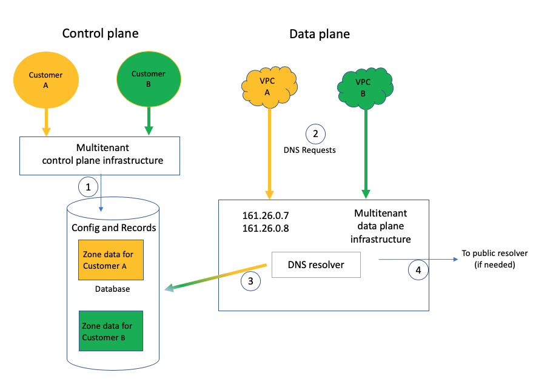

---

copyright:
  years: 2020, 2025
lastupdated: "2025-06-03"

keywords: architecture, workload isolation

subcollection: dns-svcs

---

{{site.data.keyword.attribute-definition-list}}

# About {{site.data.keyword.dns_short}} architecture and workload isolation
{: #architecture-workload-isolation}

Review the following sample architecture for {{site.data.keyword.dns_full}} to learn about different isolation levels so that you can choose the solution that best meets your needs.

## Data isolation
{: #data-isolation}

{{site.data.keyword.dns_short}} is a multitenant service, sharing the infrastructure among all customers. {{site.data.keyword.dns_short}} uses a Cloudant database to store customer-provided Domain Name System (DNS) configuration information. The data is encrypted at rest in Cloudant. Data is also encrypted in transit through SSL from the API endpoints within the control plane to the database.

{{site.data.keyword.dns_short}} handles user-initiated DNS configuration requests in the control plane. In the control plane, {{site.data.keyword.dns_short}} relies on IAM-based authorization and authentication so that only explicitly permitted users within the account can access the information. The IAM policies are enforced at the API level in a way that other user interfaces, such as UI and CLI, all inherit consistent access control policies. For information on which platform and service roles are allowed to take what action, see [Managing IAM and IBM Cloud DNS Services](/docs/dns-svcs?topic=dns-svcs-iam). 

Name resolution requests from the Virtual Private Cloud (VPC) are handled in the data plane. The user controls which VPC can access this DNS configuration data in the data plane. This can be specified using the control plane mechanism of adding a permitted network for the DNS zone. A user who has at least `Operator` level access to a VPC can add or remove that VPC as a permitted network for the DNS zone. 

When a DNS query for a particular DNS zone is received by the resolver, it identifies the VPC where the DNS query originated and validates that it can access the DNS zone of the DNS query. If the VPC doesn't have access to the DNS zone, the DNS query is forwarded to a public resolver. 

The public resolver that is used for forwarding is also in the {{site.data.keyword.cloud_notm}} private underlay. A public resolver means that it resolves public DNS zones, although it is instantiated in the {{site.data.keyword.cloud_notm}} private network. The public or private resolvers are not accessible from the internet.

Access to the multitenant control plane and data plane infrastructure is strictly controlled and restricted on an as-needed basis to a small number of operations personnel for administrative and troubleshooting purposes.

{: caption="Architectural diagram of control plane and data plane." caption-side="bottom"}

1. Customer A and Customer B create DNS configuration records through the multitenant control plane infrastructure. Records get saved in the database as separate documents. Configuration information of different users gets saved in the database.
1. A data plane DNS request from Customer A and Customer B's VPCs gets routed to the DNS resolvers `161.26.0.7` and `161.26.0.8` through the multitenant data plane infrastructure.
1. The resolver sends the request to the Cloudant database for the requested DNS record, and determines whether the VPC can access the requested DNS zone.
1. If the DNS zone information is not part of the user's configuration, the DNS query is forwarded to a public resolver.

## {{site.data.keyword.dns_short}} deployment model
{: #dns-svcs-deployment-model}

{{site.data.keyword.dns_short}} is a multitenant solution. Control plane is accessed by all customer environments through public endpoints behind {{site.data.keyword.cis_full}}. Public networks are not used for accessing the data plane of the service. Both the control and data plane of the service are shared across tenants. The service uses a Cloudant database that is accessed securely by sending requests over a public network. This data is encrypted in transit using SSL. Data is also encrypted at rest in Cloudant. 
