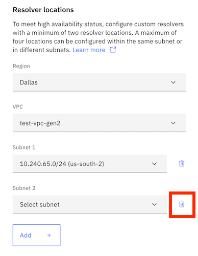

---

copyright:
  years: 2021, 2025
lastupdated: "2025-05-08"

keywords:

subcollection: dns-svcs

---

{{site.data.keyword.attribute-definition-list}}

# Configuring a custom resolver
{: #ui-create-cr}

You can add a custom resolver in {{site.data.keyword.dns_full}} by using the UI, CLI, or API.
{: shortdesc}

## Creating a custom resolver in the console
{: #create-cr-ui}
{: ui}

To add a custom resolver in {{site.data.keyword.dns_short}}, follow these steps:

   Each VPC can have only one custom resolver.
   {: note}

1. Navigate to **Custom resolvers** in the {{site.data.keyword.dns_short}} navigation menu.
1. Click **Create custom resolver**.
1. Enter a name and description for your custom resolver.
1. Select a profile from the list menu.
1. Select a region from the list menu.
1. Select a VPC from the list menu.
1. Select a subnet from the list menu.

   To achieve high availability, you must provide a minimum of two subnets. You can configure a maximum of three locations within the same subnet, or in different subnets.
   {: important}

1. Click **Add+** if you want to add another subnet.
1. Click **Create**.

   The custom resolver details view appears, where you can manage custom resolver settings.

### Creating a custom resolver without high availability
{: #cr-add-no-ha}

If you want to create a custom resolver without high availability, you must manually delete the second subnet field by clicking the trashcan icon next to the second subnet.

{: caption="Delete the second subnet to remove high availability function" caption-side="bottom"}

## Creating a custom resolver from the CLI
{: #cli-create-cr}
{: cli}

To create a custom resolver using the CLI, run the following command:

`ibmcloud dns custom-resolver-create --name NAME --location LOCATION1 --location LOCATION2 [-d, --description DESCRIPTION] [--profile Profile] [-i, --instance INSTANCE] [--output FORMAT]`

Where:

- **-n, --name** is the name of the custom resolver.
- **-d, --description** is the descriptive text of the custom resolver.
- **--location** is the location where the custom resolver is running. The location subnet CRN is required. For example: `--location subnet1,enable  --location subnet2,disable`
- **--profile** is the profile name of custom resolver. Valid values: `essential`, `advanced`, `premier`.
- **-i, --instance** is the instance name or ID. If this is not set, the context instance specified by `dns instance-target INSTANCE` is used instead.
- **--output** specifies output format. Currently, JSON is the only supported format.

To create a custom resolver without high availability, run the command with `[-f, --force]`:

`ibmcloud dns custom-resolver-create --name NAME [--location LOCATION1] [--location LOCATION2] [-description DESCRIPTION] [--profile Profile] [-f, --force] [-i, --instance INSTANCE] [--output FORMAT]`

Where:

- **-f, --force** allows for creating custom resolver with fewer than 2 locations.


## Create a custom resolver with the API
{: #api-create-cr}
{: api}

To add a custom resolver using the API, follow these steps:

1. Set up your API environment with the correct variables.
1. Store the following values in variables to be used in the API command:
    * `instance_id`, which is the unique identifier of a service instance.
    * `X-Correlation-ID`, which is a string that uniquely identifies a request.
1. When all variables are initiated, add your custom resolver:

```sh
{
  "name": "my-resolver",
  "description": "custom resolver",
  "locations": [
    {
      "subnet_crn": "crn:v1:bluemix:public:is:us-south-1:a/01652b251c3ae2787110a995d8db0135::subnet:0716-b49ef064-0f89-4fb1-8212-135b12568f04",
      "enabled": false
    }
  ],
  "profile": "essential"
}
```
{: codeblock}


## Next steps
{: #next-steps-create-cr}

* [Adding custom resolver locations](/docs/dns-svcs?topic=dns-svcs-cr-res-loc-add)
* [Custom resolver profiles](/docs/dns-svcs?topic=dns-svcs-custom-resolver#cr-profiles)
* [Setting up custom resolver forwarding rules](/docs/dns-svcs?topic=dns-svcs-cr-fwd-rules-add)
* [Deleting a custom resolver](/docs/dns-svcs?topic=dns-svcs-cr-delete)
