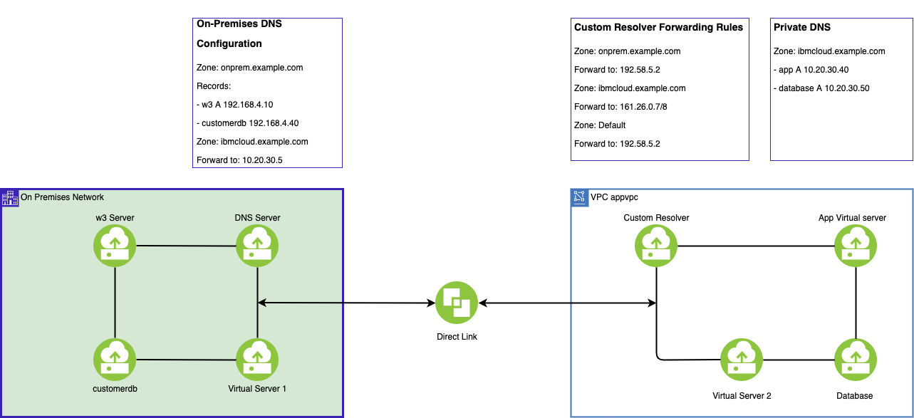

---

copyright:
  years: 2021, 2024
lastupdated: "2024-07-15"

keywords:

subcollection: dns-svcs

---

{{site.data.keyword.attribute-definition-list}}

# Custom resolvers use cases
{: #custom-resolvers-use-case}

{{site.data.keyword.dns_full}} provides custom resolvers as a service that offers the ability to customize the zone resolving rules for different hostnames. The custom resolver feature offers fine-grained control of name resolution and forwarding of DNS Queries to and from on-premises DNS resolvers.
{: shortdesc}

In this example scenario, financial data is in the on-premises instance and you manage this data access under the DNS zone `fin.example.com`, which is managed by your on-premises DNS servers. Your applications that are running in the IBM Cloud VPC must access financial data with hostnames under this DNS zone.

In this case, you can create custom resolvers to forward the DNS queries on this DNS zone to your on-premises DNS servers. You can also use the custom resolvers to customize rules to forward DNS queries to {{site.data.keyword.dns_short}} servers, public resolvers, or even custom resolvers launched in other IBM Cloud VPCs.

## Custom resolver concepts
{: #cr-concepts}

A custom resolver is a logical object that is created for an IBM Cloud VPC in a {{site.data.keyword.dns_short}} instance. Within the custom resolver, you can specify the locations where you want to launch the underlying DNS forwarders for the custom resolver. The custom resolver location is equivalent to the subnet in the IBM Cloud VPC. You can create a custom resolver by specifying only one location, or up to three locations in different subnets in the same VPC. The default configuration is highly available, with two locations.

A custom resolver can have multiple forwarding rules to customize where (and on which DNS zones) the DNS queries should be forwarded to. A default forwarding rule is automatically created along with the custom resolver to forward DNS queries to {{site.data.keyword.dns_short}} servers.

## Use cases and workflows
{: #cr-use-cases}

The most common use cases of custom resolvers are:

- Forwarding DNS queries from an IBM Cloud VPC to your on-premises DNS servers, or the reverse.
- Forwarding DNS queries from an IBM Cloud VPC to public resolvers.
- Forwarding DNS queries from one IBM Cloud VPC to another.

You can perform the following workflows from the {{site.data.keyword.dns_short}} dashboard. Navigate to the **Custom resolver** tab to view your custom resolvers.
{: note}

### Creating a custom resolver with forwarding rules
{: #create-cr}

Follow this workflow to create a custom resolver with forwarding rules:

1. Create a custom resolver by selecting the region, VPC, and adding at least two locations for high availability.
1. The default forwarding rule is automatically created to forward all DNS queries to {{site.data.keyword.dns_short}} servers.
1. Create a forwarding rule to specify where the DNS queries on a DNS zone should be forwarded to, and on which DNS servers.
1. Enable the custom resolver.

The default forwarding rule is always used last if the query name doesn't match any of the preceding forwarding rules.
{: note}

#### Custom resolver with forwarding rules example
{: #cr-fr-example}

For example, suppose you have a Private DNS zone defined as `ibmcloud.example.com` and that you configured the permitted network as the VPC `appvpc` deployed in the Dallas region. The zone `ibmcloud.example.com` has the following A records:

* `app.ibmcloud.example.com` A `10.20.30.40`
* `database.ibmcloud.example.com` A `10.20.30.50`

You also have a zone `onprem.example.com`, which is defined in the on-premises DNS server `192.168.5.2`, and that zone has the following A records:

* `w3.onprem.example.com` A `192.168.4.10`
* `customerdb.onprem.example.com` A `192.168.4.40`

The resolver server instance IP address is `10.20.30.5`.

{: caption="Figure 1. Diagram of a custom resolver with forwarding rules" caption-side="bottom"}

Based on the configuration in Figure 1, this is how DNS name resolution occurs:

* Virtual server 2 DNS query for `w3.onprem.example.com`:
    * The resolver for virtual server 2 is a custom resolver, so the DNS query is sent to `10.20.30.5`.
    * The customer resolver is based on the forwarding rule for `onprem.example.com`, which sends the query to `192.58.5.2`.
    * The on-premises DNS server responds with `w3.onprem.example.com` A `192.168.4.10`.
    * The custom resolver responds to virtual server 2 with the answer and caches the response.
* Virtual server 1 DNS query for `database.ibmcloud.example.com`:
    * The resolver for virtual server 1 is an on-premises DNS server, so the DNS query is sent to `192.58.5.2`.
    * The DNS server is based on the forwarding rule, and sends the query to the custom resolver `10.20.30.5`.
    * The custom resolver is based on the forwarding rule, and sends the query to Private DNS `161.26.0.7/8`.
    * The Private DNS responds with `database.ibmcloud.example.com` A `10.20.30.50`.
    * The custom resolver responds to the query and caches the response.
    * The DNS server responds to the query to virtual server 1 and caches the response.

In this example, Direct Link is used to connect to on-premises DNS service/clients with a custom resolver in the VPC. Direct Link can be replaced with a transit gateway to connect other VPCs or public gateways in a subnet with a custom resolver.

### Forwarding DNS queries to {{site.data.keyword.dns_short}} servers
{: #fwd-dns-svcs}

To forward DNS queries on a specific DNS zone to {{site.data.keyword.dns_short}} servers, enter the forwarding IP addresses `161.26.0.7` and `161.26.0.8`.

### Forwarding DNS queries to a public resolver
{: #fwd-public-resolver}

To forward DNS queries on a specific DNS zone to public resolvers on the internet, create a public gateway and attach it to the subnet used for the custom resolver location. Do this before entering the public resolver IP addresses as the forwarding IP.

For more information about connecting to external networks, see [External connectivity](/docs/vpc?topic=vpc-about-networking-for-vpc#external-connectivity).
{: note}

### Forwarding DNS queries across VPCs
{: #fwd-across-vpcs}

You might want to create custom resolvers on multiple VPCs and use these custom resolvers to follow the spoke-and-hub paradigm. In this configuration, you must interconnect the VPCs through a transit gateway in advance.

For more information about interconnecting VPCs using a transit gateway, see [Managing transit gateways](/docs/transit-gateway?topic=transit-gateway-adding-connections).

To form the spoke-and-hub topology for custom resolvers across different VPCs, choose one custom resolver as the hub and manage its forwarding rules in the hub custom resolver. You must also edit the default forwarding rule in each spoke custom resolver to forward DNS queries to the hub custom resolver.

### Adding a secondary zone to a custom resolver
{: #add-sz-cr}

The following sections show some use cases for adding a secondary zone to your custom resolvers.

#### Duplicate zone records from on-premises DNS servers to custom resolver locations
{: #dupe-zone-records}

This duplication provides increased availability for zone records. If the on-premises servers become unavailable for any reason, you can make DNS queries to custom resolver locations which then return the same responses as the on-premises servers.

After the zone has been configured, records are automatically updated in the custom resolver locations so that any changes made to on-premises records are reflected in the custom resolver locations.

#### DNS queries for secondary zone records can be made within the VPC to custom resolver locations directly
{: #dns-queries-in-vpc}

To increase DNS query response times, you can choose a DNS server that is closer to the source. For instance, if the query is being made in the on-premises network, it can be directed at the on-premises DNS servers. Alternatively, if the query is being made in your VPC network, it can be directed at a configured custom resolver location.
