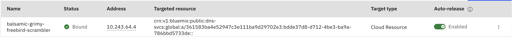

---

copyright:
  years: 2021, [{CURRENT_YEAR}]
lastupdated: "[{LAST_UPDATED_DATE}]"

keywords:

subcollection: dns-svcs

---

{{site.data.keyword.attribute-definition-list}}

# Working with custom resolvers
{: #custom-resolver}

A private DNS custom resolver extends {{site.data.keyword.dns_full}}'s capability to meet the needs of a hybrid cloud environment by enabling resolution of the {{site.data.keyword.cloud_notm}} VPC hostnames from on-premises DNS resolvers, and also enables the  resolution of on-premises hostnames from the {{site.data.keyword.cloud_notm}}.
{: shortdesc}

Key features of the custom resolver:

* Extends DNS resolutions to resolvers residing on-premises
* Allows for resolution fallback to a secondary resolver location (if one is configured) when the primary resolver location is not available

## Custom resolver overview
{: #custom-resolver-overview}

To get started using a custom resolver, you must create a custom resolver and then add forwarding rules to it.

It is expected that the custom resolver will be configured for High Availability by default. Follow the steps in [Creating a custom resolver without high availability](/docs/dns-svcs?topic=dns-svcs-ui-create-cr&interface=ui#cr-add-no-ha) if you do not want a highly available configuration.
{: important}

After you create the custom resolver and configure its forwarding rules, the resolver can be enabled for the VPC. This results in the DHCP option for the resolver changing to the custom resolver IP addresses.

## Reserved IP for custom resolvers
{: #about-reserved-ip}

Virtual appliances are created for custom resolvers to serve DNS queries, or for [global load balancer health checks](/docs/dns-svcs?topic=dns-svcs-global-load-balancers#add-a-health-check) to send probes to your origin servers that monitor their health status. The virtual appliance is fully managed by {{site.data.keyword.dns_short}}, however, you can go to the **Subnets for VPC** dashboard and view the details of a subnet to see the reserved IPs of that subnet. You can see which IP address is bound to the network interface on the virtual appliance managed by {{site.data.keyword.dns_short}}.

{: caption="Figure 1. Reserved IP for virtual appliance managed by {{site.data.keyword.dns_short}}" caption-side="bottom"}

From the **Targeted resource** column, you can view which reserved IP is bound to a DNS service instance that has a virtual appliance connected to your subnet. It is recommended that you keep **Auto-release** enabled (the default setting). With Auto-release, this IP address automatically releases to the IP address pool after the virtual appliance is deleted, as part of the deletion process for custom resolvers and global load balancer pools.

Disabling Auto-release can disrupt DNS Services recovery operations.
{: important}

## Custom resolver addresses propagation to compute instances
{: #about-address-propagation}

The reserved IP addresses for each custom resolver location are collectively referred to as the custom resolver addresses. When you have multiple locations enabled in a custom resolver, the propagation of these custom resolver addresses to compute instances on the VPC takes account of any proximity and load balancing optimization rules.

The proximity rule is considered the preferred rule to determine primary DNS server for compute instances, and then load balancing optimization is considered when an availability zone doesn't have a location. The following example describes the rules for determining primary DNS server assignment to compute instances in each availability zone.

### Example 1: Three locations in different availability zones
{: #cr-ex1-prop-to-compute}

In this example, each availability has exactly one custom resolver location.

Custom resolver: `R`:
* location-1 in us-south-1 has address: `A1`
* location-2 in us-south-2 has address: `A2`
* location-3 in us-south-3 has address: `A3`

Proximity is the sole policy to determine the primary DNS servers for compute instances in each availability zone:
* us-south-1: `A1` (primary), `A2`, `A3`.
* us-south-2: `A2` (primary), `A1`, `A3`.
* us-south-3: `A3` (primary), `A1`, `A2`.

### Example 2: Two of three locations in the same availability zone
{: #cr-ex2-prop-to-compute}

In this example, two of three locations are in the same availability zone `us-south-1`, but there are no locations in `us-south-3`.

Custom resolver: `R`:
* location-1 in us-south-1 has address: `A1`
* location-2 in us-south-1 has address: `A2`
* location-3 in us-south-3 has address: `A3`

The proximity rule is applied first to determine primary DNS servers for `us-south-1` and `us-south-3` because these two availability zones have locations. Next, the load balancing optimization rule is used to selected the `location-2` as the primary server for `us-south-2`. Consequently, the resultant DNS servers for compute instances in each availability zone will be:
* us-south-1: `A1` (primary), `A2`, `A3`.
* us-south-3: `A3` (primary), `A1`, `A2`.
* us-south-2: `A2` (primary), `A1`, `A3`.

### Example 3: All 3 locations are in the same availability zone
{: #cr-ex3-prop-to-compute}

In this example, all locations are in the same availability zone `us-south-1`, but there are no locations in `us-south-2` and `us-south-3`.

Custom resolver: `R`:
* location-1 in us-south-1 has address: `A1`
* location-2 in us-south-1 has address: `A2`
* location-3 in us-south-1 has address: `A3`

The proximity rule selects location-1 as the primary DNS sever for `us-south-1`. Then, the load balancing optimization rule assigns a primary DNS server for `us-south-2` and `us-south-3` to location-2 and location-3, respectively. The resultant DNS servers for compute instances in each availability zone will be:
* us-south-1: `A1` (primary), `A2`, `A3`.
* us-south-2: `A2` (primary), `A1`, `A3`.
* us-south-3: `A3` (primary), `A1`, `A2`.

### Example 4: Number of custom resolver locations is less than 3
{: #cr-ex4-prop-to-compute}

In this example, the custom resolver has fewer than 3 locations.

Custom resolver: `R`:
* location-1 in us-south-1 has address: `A1`
* location-2 in us-south-2 has address: `A2`

In this case, at least one location is used as the primary DNS server for two availability zones. After following the aforementioned rules, the resultant DNS servers for compute instances in each availability zone will be:
* us-south-1: `A1` (primary), `A2`.
* us-south-2: `A2` (primary), `A1`.
* us-south-3: `A1` (primary), `A2`.

## Custom resolver status
{: #cr-statuses}

The status of a newly-created custom resolver is initially `Critical` because the resolver location is not yet enabled. The status changes to `Healthy` after the resolver location changes to `Up`.
{: note}

The following status definitions apply to the resolver locations:
* **Up** - when the resolver location is functioning.
* **Down** - when the resolver location is not functioning.

The following status definitions apply to the custom resolver:
* **Healthy** - when all resolver locations are `Up`, the status is `Healthy`.
* **Degraded** - when there is more than one resolver location, and one is `Up` but another is `Down`, then the status changes to `Degraded`.
* **Critical** - when all resolver locations are `Down`, the status changes to `Critical`.

## Custom resolvers limits
{: #cr-limits}

The following limits exist for the custom resolvers feature:

* Each VPC can have a maximum of one custom resolver.
* Each custom resolver can have a maximum of 3 locations, either within the same subnet or in different subnets.
* Each custom resolver can have a maximum of 100 forwarding rules.
* You cannot delete the subnet that is used for the custom resolver.
* You must manually add rules to your security groups to allow traffic from your virtual server instance to the resolver location virtual server instance.

