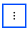

---

copyright:
  years: 2022, 2024
lastupdated: "2024-10-25"

keywords:

subcollection: dns-svcs

---

{{site.data.keyword.attribute-definition-list}}

# Deleting a linked zone
{: #deleting-linked-zone}

Delete a linked zone by using the UI, CLI, or API.
{: shortdesc}

## Deleting a linked zone in the UI
{: #ui-delete-linked-zone}
{: ui}

To delete a linked zone using the UI, take the following steps:

1. Navigate to the **Zones** section of your {{site.data.keyword.dns_short}} instance, then select the **Linked zones** tab.
1. Click overflow menu  of the linked zone you want to delete.
1. Select **Delete linked zone**.


## Deleting a linked zone from the CLI
{: #cli-delete-linked-zone}
{: cli}

To delete a linked zone using the CLI, run the following command:

```sh
ibmcloud dns cross-account linked-zone-delete LINKED_ZONE_ID [-i, --instance INSTANCE] [--output FORMAT]
```
{: pre}

Where:

* **LINKED_ZONE_ID** is the ID of linked zone.
* **-i, --instance value** is the instance name or ID. If not set, the context instance specified by `ibmcloud dns instance-target INSTANCE` is used.
* **--output value** specifies the output format. Currently, `json` is the only supported format.

## Deleting a linked zone with the API
{: #api-delete-linked-zone}
{: api}

To delete a linked zone using the API, follow these steps:

1. Set up your API environment with the correct variables.
1. Store the following values in variables to be used in the API command:
    * `INSTANCE_ID`, which is the unique identifier of a service instance.
    * `LINKED_DNSZONE_ID` which is the unique identifier of a linked zone.
    * `IAM_TOKEN`, which is the IAM authorization token.
1. When all variables are initiated, delete the linked zone:

    ```sh
    curl -X DELETE \
        https://api.dns-svcs.cloud.ibm.com/v1/instances/$INSTANCE_ID/linked_dnszones/$LINKED_DNSZONE_ID \
        -H "Authorization: $IAM_TOKEN"
    ```
    {: pre}
