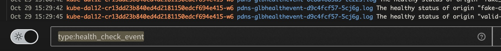
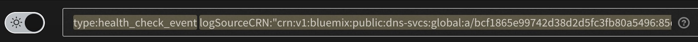
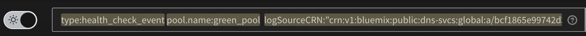
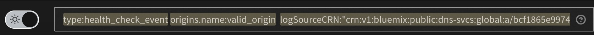
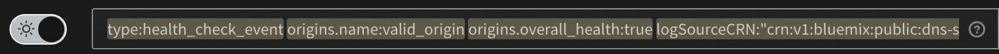

---

copyright:
  years: 2020, 2024
lastupdated: "2024-11-27"

keywords:

subcollection: dns-svcs

---

{{site.data.keyword.attribute-definition-list}}

# Viewing health check events
{: #health-check-events}

When using global load balancing, you can create a health check to specify how the origin's health is monitored. Health check events are status changes from monitored origin pools and their associated origin servers. If an origin's status changes, a new event is recorded with the event's description.
{: shortdesc}

As of 28 March 2024, the {{site.data.keyword.la_full_notm}} service is deprecated and will no longer be supported as of 30 March 2025. Customers will need to migrate to {{site.data.keyword.logs_full_notm}} before 30 March 2025. During the migration period, customers can use {{site.data.keyword.la_full_notm}} along with {{site.data.keyword.logs_full_notm}}. Logging is the same for both services. For information about migrating from {{site.data.keyword.la_full_notm}} to {{site.data.keyword.logs_full_notm}} and running the services in parallel, see migration planning. {: important}

{{site.data.keyword.loganalysisfull}} manages system and application logs in the IBM Cloud. You can use this service to access health check events for your origin pools and origin servers. For more information, see the [Getting started tutorial](/docs/log-analysis?topic=log-analysis-getting-started) for {{site.data.keyword.loganalysislong_notm}}.

## Before you begin
{: #loganalysis-preparation}

To view health check events in {{site.data.keyword.loganalysisshort}}, make sure that you create an {{site.data.keyword.loganalysislong_notm}} instance in the Frankfurt region in the account.

## Adding {{site.data.keyword.loganalysisshort}}
{: #loganalysis-nav}

From the UI, follow these steps to navigate to the {{site.data.keyword.loganalysisshort}} service:

1. From the {{site.data.keyword.dns_short}} navigation menu, click **Global load balancers**, then select the **Health checks** tab.
1. For new logging, click **Add logging** to start creating a new {{site.data.keyword.loganalysisshort}} instance.
1. To view existing {{site.data.keyword.loganalysisshort}} instances, click **Launch logging**.

{{site.data.keyword.loganalysislong_notm}} opens in a new tab.

## Receiving health check events with the {{site.data.keyword.loganalysisshort}} instance
{: #receiving-health-check-events-loganalysis}

To view health check events in a {{site.data.keyword.loganalysisshort}} instance, you must configure the {{site.data.keyword.loganalysisshort}} instance to receive platform logs with the following steps:

1. In the {{site.data.keyword.cloud_notm}} UI, click the menu icon  and select **Observability**. The Observability dashboard appears.
1. Select **Logging**. The list of logging instances appears.
1. Click **Configure platform logs**.
1. Select the `Frankfurt` region, then select one {{site.data.keyword.loganalysisshort}} instance where you want to receive the platform logs.
1. Click **Save**.

### Viewing health check events in the {{site.data.keyword.loganalysisshort}} instance
{: #viewing-health-check-events-loganalysis}

To view health check events, use the UI of the {{site.data.keyword.loganalysisshort}} instance that you configured to receive the platform logs in the previous steps.

For more information, see [Launching the {{site.data.keyword.loganalysisshort}} web UI through the IBM Cloud UI](/docs/log-analysis?topic=log-analysis-launch#launch_cloud_ui).

To search health check events from within the logging instance, enter the health check event type `health_check_event` in the **Search** field.

{: caption="Search within logging instance" caption-side="bottom"

You can also search for the events you want by combining other event fields. For example:

- Search health check events for a specific {{site.data.keyword.dns_short}} instance.
    {: caption="Search events by CRN" caption-side="bottom"
- Search health check events for a pool by specifying its `name` and its {{site.data.keyword.dns_short}} instance.
    {: caption="Search events by CRN and pool name" caption-side="bottom"
- Search health check events for an origin by specifying its `name` and its {{site.data.keyword.dns_short}} instance.
    {: caption="Search events by CRN and origin name" caption-side="bottom"
- Search health check events for an origin when its status becomes healthy by specifying its `name` and `overall_health` fields and also its {{site.data.keyword.dns_short}} instance.
    {: caption="Search events by CRN, origin name, and health" caption-side="bottom"
- Search health check events for a pool when its status becomes DEGRADED by specifying its `name` and `healthy` fields and also its {{site.data.keyword.dns_short}} instance.
    {: caption="Search events by CRN, pool name, and health" caption-side="bottom"

## Health check event properties
{: #health-check-event-properties}

Health check event records have the following properties:

- `event_time`: The time at which the event was recorded. For example, `2020-10-28T15:04:05.00+0000`.
- `logSourceCRN`: CRN of the {{site.data.keyword.dns_short}} instance in which the origin pools and origin servers were created.
    For example: `crn:v1:bluemix:public:dns-svcs:global:a/bcf1865e99742d38d2d5fc3fb80a5496:85ed7b9d-cd48-4881-b354-52eb1d8e9011::`
- `type`: The value of this property is `health_check_event` for health check events.
- `origins`: An array of objects representing the origin servers associated with the origin pool. For example:

    ```sh
    [
         {
             "name": "web-server1",
             "address": "10.240.0.4",
             "enabled": true,
             "healthy": true,
             "overall_health": true,
             "health_failure_reason": "SUCCESS",
             "changed": true
         },
         {
             "name": "web-server2",
             "address": "10.240.100.4",
             "enabled": true,
             "overall_health": false,
             "health_failure_reason": "CONNECTION_ERROR",
             "changed": false
         }
     ]
    ```
    {: codeblock}

- `pool`: An object that represents the origin pool for which the health check event was generated. For example:

    ```sh
    {
        "id": "987f3f96-c077-4124-87eb-846dc026e383",
        "name": "us-south-pool",
        "healthy_origins_threshold": 1,
        "enabled": true,
        "healthy": "DEGRADED",
        "changed": false
    }
    ```
    {: codeblock}
