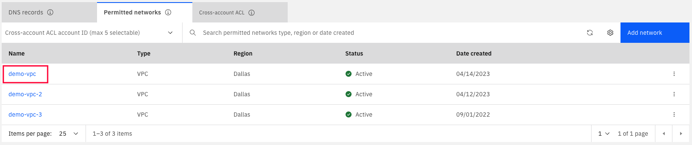
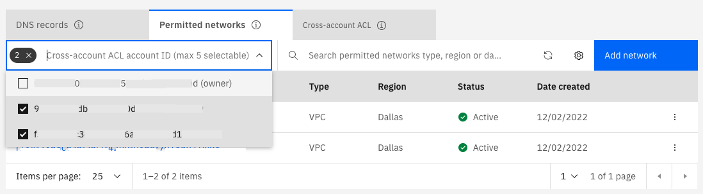

---

copyright:
  years: 2019, 2024
lastupdated: "2024-07-16"

keywords:

subcollection: dns-svcs

---

{{site.data.keyword.attribute-definition-list}}

# Managing permitted networks
{: #managing-permitted-networks}

This section describes how to manage permitted networks for your {{site.data.keyword.dns_full}} instance.
{: shortdesc}

## Using the IBM Cloud console
{: #managing-permitted-networks-ui}
{: ui}

### Adding permitted networks
{: #adding-permitted-networks-ui}

DNS Services is a global service, therefore you may add permitted networks (for example, a VPC) from any {{site.data.keyword.cloud}} region. This request adds the network to the DNS zone, thereby giving the network access to the zone. You can add up to 10 permitted networks to a DNS zone.

Newly created virtual server instances are automatically configured to use private DNS resolvers (`161.26.0.7` and `161.26.0.8`). Existing virtual server instances can take up to 3 minutes to be configured to use private DNS resolvers.
{: tip}

1. Select the desired zone from the table on the DNS Zones page.
1. Select the **Permitted Networks** tab.
1. Click the **Add Network** button.
1. In the panel that appears, select the region of your network from the **Network Region** list menu.
1. Select the desired network from the **Network** list menu that appears.
1. Click **Add Network**.

Adding the same VPC to two DNS zones of the same name is not allowed.
{: note}

### Navigating from permitted networks to VPC overview
{: #navigating-to-vpc}

You can navigate to the VPC overview page from the **Permitted networks** section by clicking on the VPC name. For example, in the following image, clicking on `demo-vpc` takes you to the overview page of the VPC named `demo-vpc`.

{: caption="Figure 1. Navigating to an IBM VPC from permitted networks section" caption-side="bottom"}

### List permitted networks
{: #list-permitted-networks}

1. Select the desired zone from the table on the DNS Zones page.
1. Select the **Permitted Networks** tab.

{: caption="Figure 2. Filter by cross-account ACL account ID" caption-side="bottom}
By default,the list contains permitted networks that were added from your account as the owner. To see permitted networks added by cross-account ACL users, you can use a filter by selecting the account IDs.

You can select a maximum of 5 cross-account IDs.
{: note}

### Removing a permitted network
{: #removing-permitted-networks-ui}

From the permitted networks table, click the **Delete** icon. Confirm the delete process in the dialog box that appears.

If a network exists in a zone, you cannot delete the zone until the permitted network is deleted.
{: note}

## Using the API
{: #managing-permitted-networks-api}
{: api}

First store the API endpoint in a variable so you can use it in API requests without having to type the full URL. For example, to store the production endpoint in a variable, run this command:

```bash
DNSSVCS_ENDPOINT=https://api.dns-svcs.cloud.ibm.com
```
{: pre}

To verify that this variable was saved, run **`echo $DNSSVCS_ENDPOINT`** and make sure the response is not empty.

### Adding permitted networks
{: #adding-permitted-networks-api}

A DNS zone's initial state is `PENDING_NETWORK_ADD`, because its permitted network list is empty when the DNS zone is created. When a permitted network is added to the DNS zone's permitted networks, the state changes to `ACTIVE`.

#### Parameters
{: #add-pm-parameters}

* DNSZONE_ID: When you create a zone, the DNSZONE_ID is returned in the response as **`id`**.

#### Request
{: #add-pm-request}

```bash
curl -X POST \
         $DNSSVCS_ENDPOINT/v1/instances/$INSTANCE_ID/dnszones/$DNSZONE_ID/permitted_networks \
         -H "Authorization: $TOKEN" \
         -d '{
             "type": "vpc",
             "permitted_network":{
                 "vpc_crn":"crn:v1:staging:public:is:us-east:a/0821fa9f9ebcc7b7c9a0d6e9bf9442a4::vpc:b7246cdf-892a-4a6c-8fa9-491a5f585bd0"
             }
         }'
```
{: pre}


#### Response
{: #add-pm-response}

```json
{
    "id": "b7246cdf-892a-4a6c-8fa9-491a5f585bd0",
    "created_on": "2019-09-11 13:46:51.68793557 +0000 UTC",
    "modified_on": "2019-09-11 13:46:51.68793557 +0000 UTC",
    "permitted_network": {
        "vpc_crn": "crn:v1:staging:public:is:us-east:a/0821fa9f9ebcc7b7c9a0d6e9bf9442a4::vpc:b7246cdf-892a-4a6c-8fa9-491a5f585bd0"
    },
    "type": "vpc",
    "state": "ACTIVE"
}
```
{: codeblock}

For future requests, the ID in the response is referenced as **`PERMITTED_NETWORK_ID`**.
{: note}

### Retrieve a permitted network
{: #get-permitted-network-api}

Retrieve a specific permitted network from your instance using the permitted network ID.

#### Request
{: #ret-pm-request}

```bash
curl -X GET \
         $DNSSVCS_ENDPOINT/v1/instances/$INSTANCE_ID/dnszones/$DNSZONE_ID/permitted_networks/$PERMITTED_NETWORK_ID \
         -H "Authorization: $TOKEN"
```
{: pre}

#### Response
{: #ret-pm-response}

```json
{
    "id": "b7246cdf-892a-4a6c-8fa9-491a5f585bd0",
    "created_on": "2019-09-11 13:46:51.68793557 +0000 UTC",
    "modified_on": "2019-09-11 13:46:51.68793557 +0000 UTC",
    "permitted_network": {
        "vpc_crn": "crn:v1:staging:public:is:us-east:a/0821fa9f9ebcc7b7c9a0d6e9bf9442a4::vpc:b7246cdf-892a-4a6c-8fa9-491a5f585bd0"
    },
    "type": "vpc",
    "state": "ACTIVE"
}
```
{: codeblock}

### Listing permitted networks
{: #list-permitted-networks-api}

List all permitted networks for your DNS zone.

#### Request list permitted networks
{: #list-pm-request}

```bash
curl -X GET \
         $DNSSVCS_ENDPOINT/v1/instances/$INSTANCE_ID/dnszones/$DNSZONE_ID/permitted_networks \
         -H "Authorization: $TOKEN"
```
{: pre}

#### Response list permitted networks
{: #list-pm-response}

```json
{
    "permitted_networks": [
        {
            "id": "b7246cdf-892a-4a6c-8fa9-491a5f585bd0",
            "created_on": "2019-09-11 13:46:51.68793557 +0000 UTC",
            "modified_on": "2019-09-11 13:46:51.68793557 +0000 UTC",
            "permitted_network": {
                "vpc_crn": "crn:v1:staging:public:is:us-east:a/0821fa9f9ebcc7b7c9a0d6e9bf9442a4::vpc:b7246cdf-892a-4a6c-8fa9-491a5f585bd0"
            },
            "type": "vpc",
            "state": "ACTIVE"
        }
    ]
}
```
{: codeblock}

### Removing a permitted network
{: #removing-permitted-networks-api}

Delete a specific permitted network from your instance, and unlink VPC from a zone.

#### Request remove permitted network
{: #remove-pm-request}

```bash
curl -X DELETE \
         $DNSSVCS_ENDPOINT/v1/instances/$INSTANCE_ID/dnszones/$DNSZONE_ID/permitted_networks/$PERMITTED_NETWORK_ID \
         -H "Authorization: $TOKEN"
```
{: pre}

#### Response
{: #remove-pm-response}

```json
{
    "id": "b7246cdf-892a-4a6c-8fa9-491a5f585bd0",
    "created_on": "2019-09-11 13:46:51.68793557 +0000 UTC",
    "modified_on": "2019-09-11 13:46:51.68793557 +0000 UTC",
    "permitted_network": {
        "vpc_crn": "crn:v1:staging:public:is:us-east:a/0821fa9f9ebcc7b7c9a0d6e9bf9442a4::vpc:b7246cdf-892a-4a6c-8fa9-491a5f585bd0"
    },
    "type": "vpc",
    "state": "REMOVAL_IN_PROGRESS"
}
```
{: codeblock}

Removing a permitted network can take up to 5 minutes. You cannot add the VPC back to the DNS zone's permitted network until the removal operation is complete.
{: note}

## Using the CLI
{: #managing-permitted-networks-cli}
{: cli}

First use the `ibmcloud dns instance-target` command to set the target operating DNS Services instance.

```bash
$ ibmcloud dns instances
Retrieving service instances for service 'dns-svcs' ...
OK

Name                 ID                                     Location   State    Service Name
DNS Services-km      ffffffff-b042-41fd-885e-000000000000   global     active   dns-svcs

$ ibmcloud dns instance-target "DNS Services-km"
```

Store the zone ID in a variable so you can use it in the following commands without having to type it every time. For example, to store the zone ID in a variable, run this command:

```bash
DNS_ZONE_ID="example.com:f7f40364-a5e6-48f7-9fc9-387434c579ae"
```
{: pre}


### Adding permitted networks
{: #adding-permitted-networks-cli}

Use `ibmcloud dns permitted-network-add` command followed by the zone ID to add a VPC to the zone's permitted networks. Follow the steps to select a VPC instance to add it to permitted networks.

```bash
$ ibmcloud dns permitted-network-add $DNS_ZONE_ID
Select Network Region
1. au-syd
2. br-sao
3. ca-tor
4. eu-de
5. eu-gb
6. jp-osa
7. jp-tok
8. us-east
9. us-south
Enter a number> 1
Network Region: US South
Select VPC Network
1. vpc-cli-example
2. vpc-g1-dal-pdns-datapath-test-not-delete
6. vpc-g2-dal-pdns-datapath-test-not-delete
Enter a number> 1
Adding permitted network for zone 'example.com:f7f40364-a5e6-48f7-9fc9-387434c579ae' ...
OK

Name          vpc-cli-example
ID            ffffffff-f7c9-49ff-a8ca-000000000000
Type          vpc
VPC_CRN       crn:v1:bluemix:public:is:us-south:a/bcf1865e991345daf4d5f24ea90a5497::vpc:ffffffff-f7c9-49ff-a8ca-000000000000
State         ACTIVE
Created On    2020-04-10 10:06:24.99659547 +0000 UTC
Modified On   2020-04-10 10:06:24.99659547 +0000 UTC
```
{: pre}


For future requests, the ID in the output is referenced as **`PERMITTED_NETWORK_ID`**.
{: note}

### Retrieve a permitted network
{: #get-permitted-network-cli}

Use `ibmcloud dns permitted-network` followed by the zone ID and permitted network ID to retrieve the details of a permitted network.

```bash
$ ibmcloud dns permitted-network $DNS_ZONE_ID $PERMITTED_NETWORK_ID
Getting permitted network 'ffffffff-f7c9-49ff-a8ca-000000000000' for zone 'example.com:f7f40364-a5e6-48f7-9fc9-387434c579ae' ...
OK

Name          vpc-gen1-for-pdns-e2e-test01-do-not-delete
ID            ffffffff-f7c9-49ff-a8ca-000000000000
Type          vpc
VPC_CRN       crn:v1:bluemix:public:is:us-south:a/bcf1865e991345daf4d5f24ea90a5497::vpc:ffffffff-f7c9-49ff-a8ca-000000000000
State         ACTIVE
Created On    2020-04-10 10:06:24.99659547 +0000 UTC
Modified On   2020-04-10 10:06:24.99659547 +0000 UTC
```
{: pre}


### Listing permitted networks
{: #list-permitted-networks-cli}

Use `ibmcloud dns permitted-networks` followed by the zone ID to list all permitted networks.

```bash
$ ibmcloud dns permitted-networks $DNS_ZONE_ID
Listing permitted networks for zone 'example.com:f7f40364-a5e6-48f7-9fc9-387434c579ae' ...
OK

Name                                         ID                                     Type   VPC_CRN                                                                                                          State
vpc-gen1-for-pdns-e2e-test01-do-not-delete   ffffffff-f7c9-49ff-a8ca-000000000000   vpc    crn:v1:bluemix:public:is:us-south:a/bcf1865e991345daf4d5f24ea90a5497::vpc:ffffffff-f7c9-49ff-a8ca-000000000000   ACTIVE
```
{: pre}


### Removing a permitted network
{: #removing-permitted-networks-cli}

Use `ibmcloud dns permitted-network-remove` followed by the zone ID and permitted network ID to unlink VPC from the zone.

```bash
$ ibmcloud dns permitted-network-remove $DNS_ZONE_ID $PERMITTED_NETWORK_ID
Really remove permitted network 'ffffffff-f7c9-49ff-a8ca-000000000000' from zone 'example.com:f7f40364-a5e6-48f7-9fc9-387434c579ae' ? [y/N]> y
Removing permitted network 'ffffffff-f7c9-49ff-a8ca-000000000000' from zone 'example.com:f7f40364-a5e6-48f7-9fc9-387434c579ae' ...
OK
```
{: pre}

Removing a permitted network can take up to 5 minutes. You cannot add the VPC back to the DNS zone's permitted network until the removal operation is complete.
{: note}
