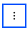

---

copyright:
  years: 2022, 2025
lastupdated: "2025-05-08"

keywords:

subcollection: dns-svcs

---

{{site.data.keyword.attribute-definition-list}}

# Deleting a secondary zone
{: #delete-secondary-zone}

Delete a secondary zone by using the UI, CLI, or API.
{: shortdesc}

## Deleting a secondary zone in the console
{: #ui-delete-secondary-zone}
{: ui}

To delete a secondary zone using the UI, take the following steps:

1. Navigate to the **Custom resolver** section of your DNS Services instance, and select the custom resolver from which you want to delete a secondary zone.
1. In the **Custom resolver details** page, select the **Secondary zone** tab.
1. Select the overflow menu icon  secondary zone you wish to delete and select **Delete**.
1. Click **Delete** in the confirmation dialog box, or click **Cancel** to stop the deletion.

## Deleting a secondary zone from the CLI
{: #cli-delete-secondary-zone}
{: cli}

To delete a secondary zone using the CLI, run the following command:

```sh
ibmcloud dns secondary-zone-delete RESOLVER_ID SECONDARY_ZONE_ID [-i, --instance INSTANCE_NAME] [--output FORMAT]
```
{: pre}

Where:

* **RESOLVER_ID** is the ID of the custom resolver. Required.
* **SECONDARY_ZONE_ID** is the ID of the secondary zone. Required.
* **-i, --instance value** is the instance name or ID. If not set, the context instance specified by ibmcloud dns instance-target INSTANCE is used.
* **--output value** specifies output format. Currently, json is the only supported format.


## Deleting a secondary zone with the API
{: #api-delete-secondary-zone}
{: api}

To delete a secondary zone using the API, follow these steps:

1. Set up your [API environment](/apidocs/dns-svcs#authentication) with the correct variables.
1. Store the following values in variables to be used in the API command:
    * `INSTANCE_ID`, which is the unique identifier of a service instance.
    * `RESOLVER_ID`, which is the unique identifier of a custom resolver.
    * `SECONDARY_ZONE_ID` is the unique identifier of a secondary zone.
    * `X-Correlation-ID` (optional), which uniquely identifies a request.
1. When all variables are initiated, delete a secondary zone:

```sh
curl -X DELETE   https://api.dns-svcs.cloud.ibm.com/v1/instances/2be5d4a7-78f0-4c62-a957-41dc15342777/custom_resolvers/ddbe7a53-7971-46dc-b021-420335c31562/secondary_zones/f97ef698-d5fa-4f91-bc5a-33f17d143b7d   -H 'Authorization: Bearer xxxxxx'
```
{: codeblock}
