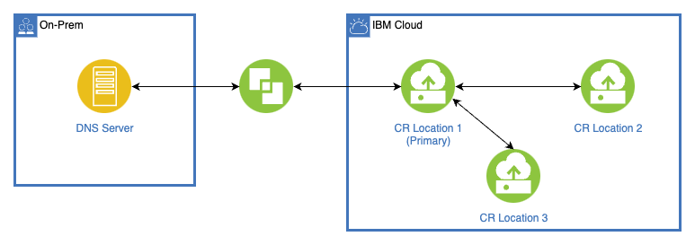
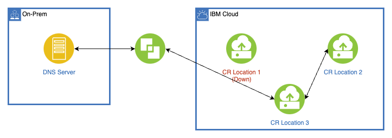

---

copyright:
  years: 2022, 2024
lastupdated: "2024-04-04"

keywords:

subcollection: dns-svcs

---

{{site.data.keyword.attribute-definition-list}}

# Understanding secondary zones
{: #sec-zones-about}

A secondary zone is a read-only copy of the primary DNS zone. Instead of getting information from local files, secondary zones receive pertinent information from a primary server in a communication process known as a zone transfer.
{: shortdesc}

With secondary zones, you can duplicate records from your on-premises DNS server to your DNS Services custom resolver. The custom resolver gives fine-grain control of name resolution and also enables forwarding DNS queries to and from on-premises DNS servers. You can make DNS queries for transferred zones within your VPC and receive the same records as if the query was made to your on-premises DNS server.

Existing custom resolvers automatically support the secondary zone feature, but you will have to create a secondary zone manually.
{: tip}

## Configuring secondary zones
{: #sec-zone-config}

When configuring secondary zones, take the following into consideration:

* Server must have the zone configured
* Server must enable DNS transfer to all custom resolver locations
* Currently, custom resolver only perform AXFR, and not IXFR
* Custom resolver uses port 53 to communicate with DNS server
* Each custom resolver can have a maximum of 5 secondary zones

## Example for secondary zone
{: #secondary-zone-example}

In this example, a customer has a zone `onprem.customer.com` which is managed by the DNS server `10.230.9.2`. In IBM Cloud, the customer has workloads running in VPCs which need to resolve resource record `database.onprem.customer.com`. Using custom resolvers and forwarding rules the customer can resolve the name by forwarding the query to DNS server `10.230.9.2`, but if the DNS server is down or has connectivity issues, the name resolution fails. To avoid this, instead of a forwarding rule the customer can configure a secondary zone rule in their custom resolver and on-premises DNS server. Then, even if there are intermittent connectivity issues reaching the on-premises DNS server, the custom resolver locations can resolve the resource record requests.

## Custom resolvers and High Availability with secondary zones
{: #cr-ha-secondary-zone}

{{site.data.keyword.dns_short}} maintain consistency between locations in a custom resolver by selecting a primary location and assigning the remaining locations as secondaries. When updates are made to the on-premises DNS server, notification messages are sent to all custom resolver locations. However, only the primary location takes the next step of sending a transfer request to the on-premises server. After the transfer from on-premises server to primary custom resolver location is completed, the zone data is also propagated to the secondary custom resolver locations.

{: caption="Figure 1. Custom resolver HA setup with 3 locations configured" caption-side="bottom"}

If there is an outage or issue with the primary custom resolver location, one of the remaining secondary custom resolver locations is selected to become the primary location. After the issue with the down custom resolver location is resolved, that custom resolver acts as a secondary custom resolver location. All custom resolver locations must be specified in your on-prem DNS server as valid destinations for zone transfers.

{: caption="Figure 2. Custom resolver HA setup with the primary location down" caption-side="bottom"}

